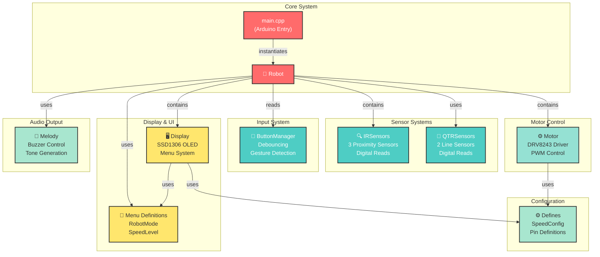
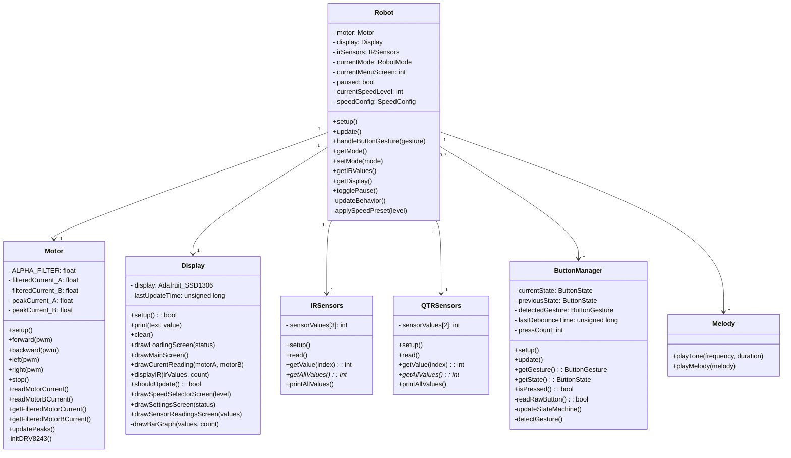
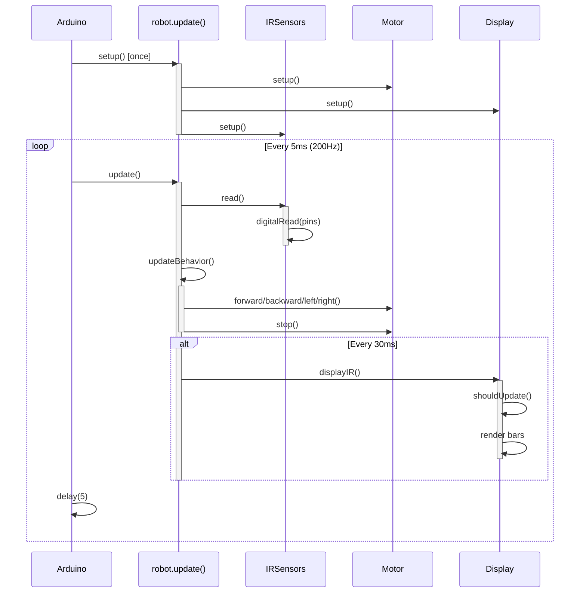
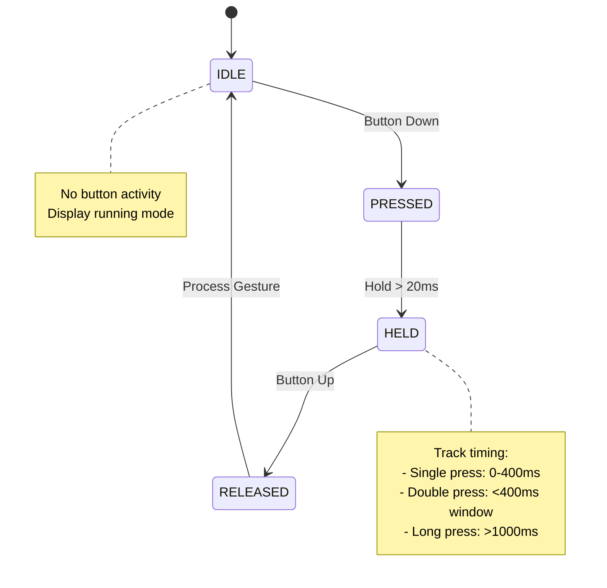
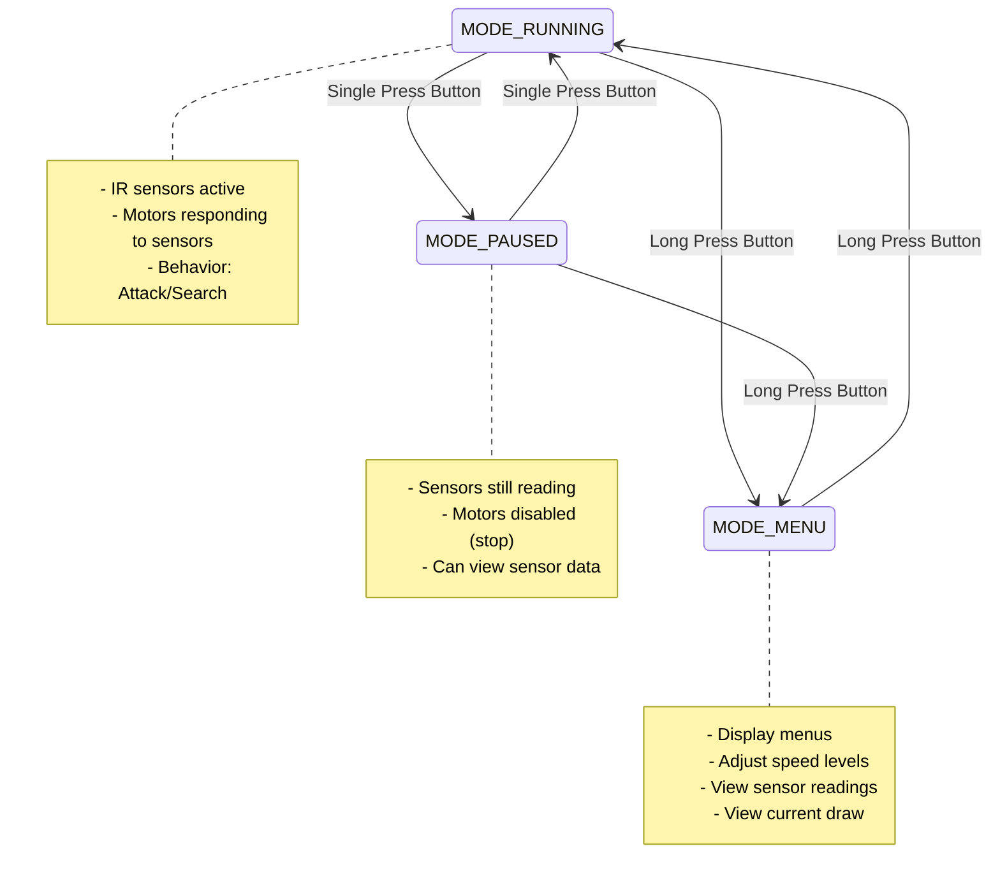
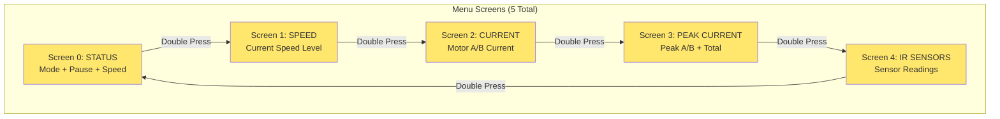
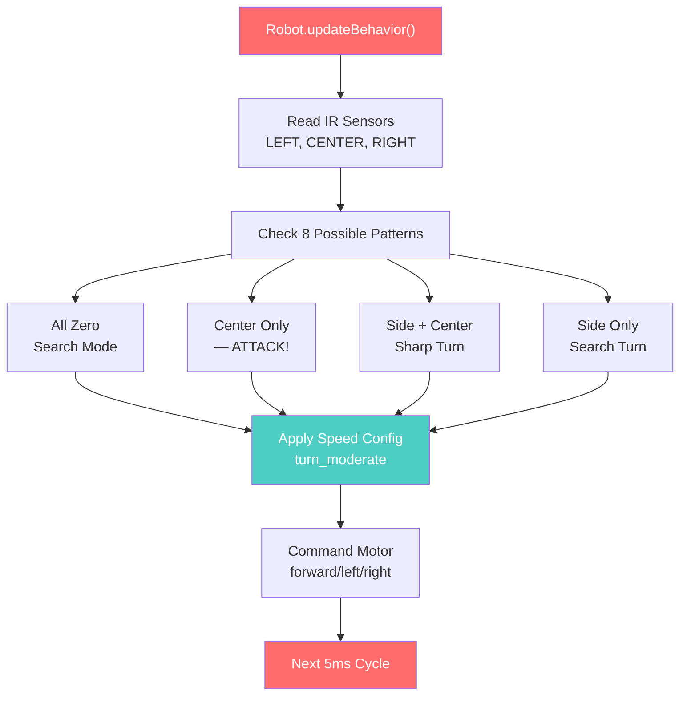
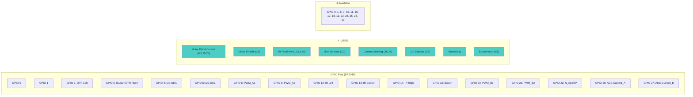
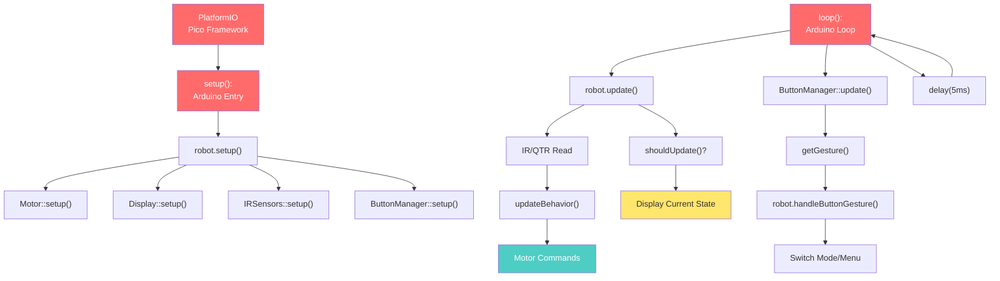

# MiniSumo2026 Project Architecture Documentation

## 📋 Table of Contents

1. [System Overview](#system-overview)
2. [Class Architecture](#class-architecture)
3. [System Flow](#system-flow)
4. [Component Details](#component-details)
5. [Hardware Pin Configuration](#hardware-pin-configuration)
6. [State Management](#state-management)

---

## System Overview

The MiniSumo2026 is a small sumo robot built on a **Raspberry Pi Pico** microcontroller. The system uses infrared sensors to detect opponents, line sensors to prevent falling off the ring, and a dual-motor drive system for movement. A menu system allows configuration via a single button, and an OLED display provides visual feedback.

**Key Specifications:**

- **Microcontroller:** Raspberry Pi Pico (RP2040)
- **Motor Driver:** DRV8243 (dual motor control)
- **Display:** Adafruit SSD1306 128x64 OLED over I2C
- **Main Loop Frequency:** ~200 Hz (5ms delay per cycle)
- **Display Update Rate:** ~33 FPS (30ms throttle)

---

## Class Architecture

### System Class Diagram



### Detailed Class Relationships



---

## System Flow

### Main Program Execution Flow



### Button Gesture Detection & Menu Navigation



### Robot Operating Modes



### Menu Screen Navigation



### IR Sensor-Based Behavior



---

## Component Details

### 🔍 Infrared Sensors (IRSensors)

**Purpose:** Detect proximity of opponent within ~10cm

| Property     | Value                                    |
| ------------ | ---------------------------------------- |
| Count        | 3 sensors                                |
| Pin Layout   | LEFT=GPIO12, CENTER=GPIO13, RIGHT=GPIO14 |
| Read Type    | Digital (HIGH/LOW)                       |
| Update Rate  | Every 5ms with robot.update()            |
| Beam Pattern | Forward-facing, ~10cm detection range    |

**Usage in Behavior:**

- **All three detect:** Opponent directly ahead → **Attack forward**
- **Center only:** Opponent straight ahead → **Attack forward**
- **Left + Center:** Opponent on left side → **Sharp left turn**
- **Right + Center:** Opponent on right side → **Sharp right turn**
- **Left or Right only:** Opponent on far side → **Gentle turn + advance**
- **None detect:** Search mode → **Rotate in place**

---

### 📍 Line Sensors (QTRSensors)

**Purpose:** Detect ring boundaries to prevent falling off

| Property   | Value                                   |
| ---------- | --------------------------------------- |
| Count      | 2 sensors                               |
| Pin Layout | LEFT=GPIO2, RIGHT=GPIO3                 |
| Read Type  | Digital (reflectance based)             |
| Mounting   | Front-facing, detecting white ring edge |

**Current Status:** Configured but behavior not yet integrated into updateBehavior()

---

### ⚙️ Motor Control System

**Motor Driver:** DRV8243 Dual H-Bridge

- **Max Current:** 2A per channel
- **Voltage:** 3.3V logic, powered by battery

| Motor     | Control Pins                       | Enable Pin        |
| --------- | ---------------------------------- | ----------------- |
| A (Left)  | GPIO 8 (PWM_A1), GPIO 9 (PWM_A2)   | GPIO 22 (N_SLEEP) |
| B (Right) | GPIO 20 (PWM_B1), GPIO 21 (PWM_B2) | GPIO 22 (N_SLEEP) |

**PWM Values (0-255):**

- 0 = No power
- 128 = 50% power
- 255 = Full power

**Current Sensing:**

- Motor A: GPIO 26 (ADC2) → reads in Amps with alpha filtering
- Motor B: GPIO 27 (ADC3) → reads in Amps with alpha filtering
- Peak current tracking automatically records maximum current draw

**Movement Commands:**

```
forward(pwm)   - Both motors forward
backward(pwm)  - Both motors backward
left(pwm)      - Left motor back, Right motor forward (spin left)
right(pwm)     - Right motor back, Left motor forward (spin right)
stop()         - Both motors off
```

---

### 🖥️ Display System (SSD1306 OLED)

**Hardware:**

- Resolution: 128x64 pixels
- Communication: I2C (SDA=GPIO4, SCL=GPIO5)
- Refresh Throttle: 30ms (~33 FPS)

**Menu Screens:**

| Screen # | Name         | Purpose                                       |
| -------- | ------------ | --------------------------------------------- |
| 0        | STATUS       | Shows current mode, pause status, speed level |
| 1        | SPEED        | Current speed level (LOW/MEDIUM/HIGH)         |
| 2        | CURRENT      | Real-time motor A & B current draw            |
| 3        | PEAK CURRENT | Peak values and total peak current            |
| 4        | IR SENSORS   | IR sensor status as bar graphs                |

**Display Refresh Logic:**

- `shouldUpdate()` checks if ≥30ms since last refresh
- Prevents excessive I2C writes that would slow down main loop
- Actual display updates happen at ~33 FPS max

---

### 🔘 Button Manager System

**Button Hardware:**

- Pin: GPIO 15
- Type: Active-low (INPUT_PULLUP)
- Debounce Time: 20ms
- Uses Timer-based gesture detection

**Gesture Detection:**

| Gesture      | Timing                  | Use                              |
| ------------ | ----------------------- | -------------------------------- |
| Single Press | Press + Release < 400ms | Toggle Pause / Cycle Menu Screen |
| Double Press | 2 presses < 400ms apart | Cycle Speed Level / Next Menu    |
| Long Press   | Press > 1000ms          | Enter/Exit Menu Mode             |

**Button State Machine:**

```
IDLE → PRESSED → HELD → RELEASED → [Gesture Detection] → IDLE
       ↑_________________________________↑
       (debounce 20ms prevents flicker)
```

---

### 🎵 Audio System (Melody)

**Buzzer Hardware:**

- Pin: GPIO 3 (PWM tone output)
- Frequency Range: 20Hz - 20kHz (any audible tone)
- Implementation: Tone generation via PWM

**Usage in Robot:**

- Startup confirmation
- Attack sounds
- Error alerts
- Movement feedback

---

## Hardware Pin Configuration

### Complete Pin Map



### Conflict Note ⚠️

**GPIO 3 Conflict:** The QTR Right sensor and Buzzer share GPIO 3. Currently buzzer has priority. To use QTR Right sensor effectively, buzzer would need to be moved to an available GPIO.

---

## State Management

### Speed Configuration System

**Global `SpeedConfig` object** allows menu to adjust behavior in real-time:

```cpp
struct SpeedConfig {
    int attack_speed;          // Speed when attacking (detect center)
    int search_speed;          // Speed when searching
    int turn_speed_aggressive; // Sharp turns (180° detections)
    int turn_speed_moderate;   // Standard turns (side detections)
    int turn_speed_gentle;     // Subtle corrections
};
```

**Speed Presets (3 Levels):**

| Aspect        | LOW | MEDIUM | HIGH |
| ------------- | --- | ------ | ---- |
| Attack        | 150 | 200    | 255  |
| Search        | 80  | 120    | 180  |
| Turn Moderate | 20  | 25     | 40   |
| Turn Gentle   | 10  | 15     | 25   |

These presets are selectable from the SPEED menu screen.

---

### Robot State Variables

```cpp
class Robot {
    RobotMode currentMode;      // MODE_MENU, MODE_RUNNING, MODE_PAUSED
    int currentMenuScreen;      // 0-4: which menu screen displayed
    bool paused;                // true = motors stopped, sensors active
    int currentSpeedLevel;      // 0=LOW, 1=MEDIUM, 2=HIGH
    SpeedConfig speedConfig;    // Current speed values
};
```

### Mode Transitions

- **RUNNING → PAUSED:** Single press button
- **PAUSED → RUNNING:** Single press button
- **Any → MENU:** Long press button (>1000ms)
- **MENU → RUNNING:** Long press button from menu
- **In MENU:** Double press = cycle through 5 screens

---

## 📊 System Timing

| Component         | Frequency          | Period   |
| ----------------- | ------------------ | -------- |
| Main Loop         | ~200 Hz            | 5ms      |
| Sensor Reads      | 200 Hz             | 5ms      |
| Behavior Update   | 200 Hz             | 5ms      |
| Display Refresh   | ~33 Hz (throttled) | 30ms     |
| Button Update     | 200 Hz             | 5ms      |
| Gesture Detection | Real-time          | Variable |

---

## 🔗 Data Flow Summary



---

## End of Architecture Documentation

For implementation details, see individual `.cpp` source files.
For hardware setup and datasheets, see `docs/datasheets/`
